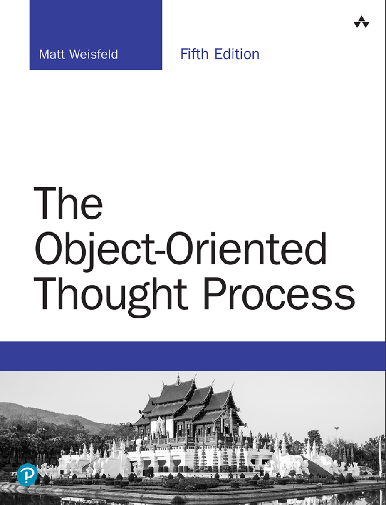

# The Object-Oriented Thought Process

《The Object-Oriented Thought Process, 5th Edition》

这里主要记录学《The Object-Oriented Thought Process, 5th Edition》过程中，做的相关知识和代码的记录。

## 1. 目录

+ [0. 面向对象概念简介](./Chapters/ch00.md)
+ [1. 面向对象概念介绍](./Chapters/ch01.md)