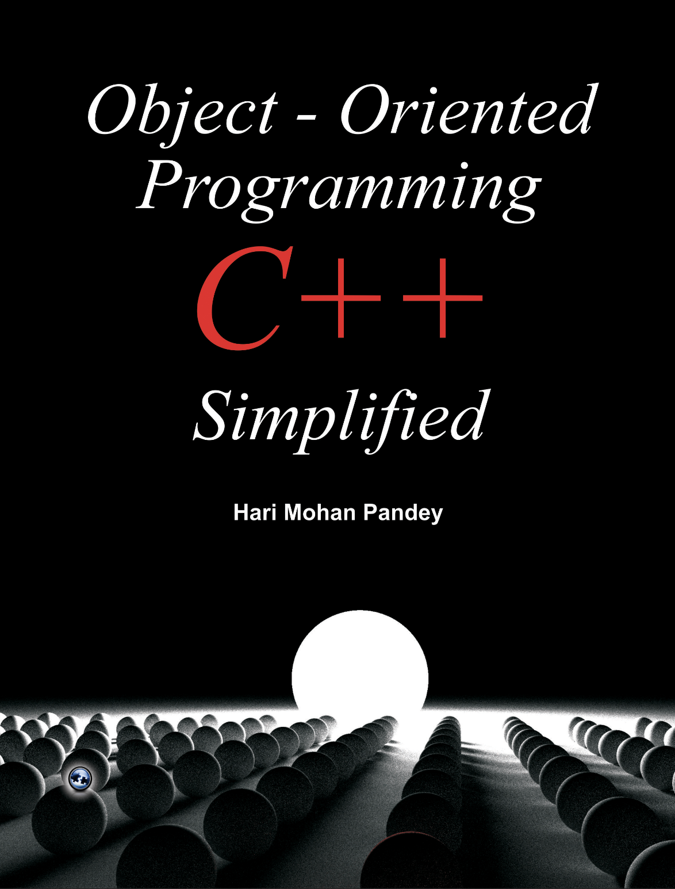

# OOPByCXX

*Object Oriented Programming C++ Simplified learning documents.*

本仓库主要记录学习《Object Oriented Programming C++ Simplified》
一书过程中，一些重要笔记和代码测试。

## 1. 目录

+ [O. OOPs 简介](./Chapter/ch0.md)
+ [1. 面向对象设计简介]()
+ [2. C++]()